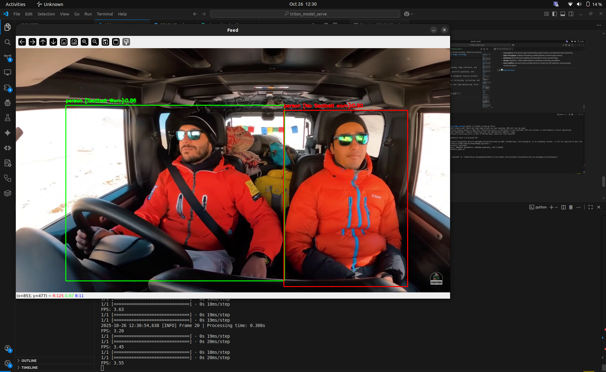
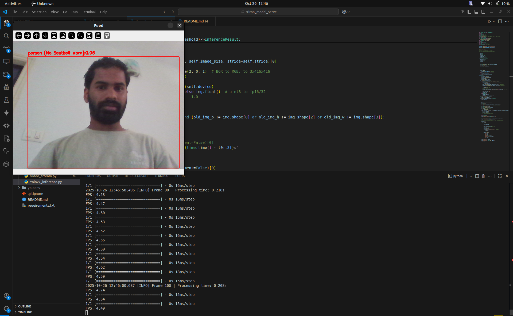

# 🚗 Seatbelt Detection System  
### YOLOv7 + TensorFlow Classifier + Triton Inference

A modular, real-time **seatbelt detection pipeline** for computer vision applications.  
Supports both **local inference** (on-device YOLOv7 + TensorFlow) and **remote inference** via **NVIDIA Triton Inference Server**.

---

## 📁 Project Structure

```

seatbelt_detection/
├── docs/
│   ├── Screencast from 10-23-2025 06:48:28 PM.webm
│   └── Screenshot from 2025-10-23 18-50-05.png
│
├── logs/
│   ├── detections_log.csv
│   └── predictions.log
│
├── model/
│   ├── default_model.pt
│   ├── labels.txt
│   └── seatbelt_classifier.h5
│
├── models_for_triton/
│   ├── object_detection/
│   └── seatbelt/
│
├── src/
│   ├── cfg/
│   ├── models/
│   ├── utils/
│   │   ├── general.py
│   │   ├── torch_utils.py
│   │   ├── datasets.py
│   │   ├── processing.py
│   │   ├── render.py
│   │   └── labels.py
│   ├── Triton_client.py
│   ├── Video_stream.py
│   └── Yolov7_inference.py
│
├── yolovenv/                # Optional virtual environment
├── .gitignore
├── README.md
└── requirements.txt

````

---

## 🧠 Overview

This system detects **drivers and passengers** in real time and determines whether they are **wearing seatbelts**.  
It uses:
- **YOLOv7** for object detection (person, driver).
- **Keras/TensorFlow classifier** for seatbelt prediction.
- **Triton Inference Server** for scalable, GPU-based model serving (optional).
- Real-time visualization & logging to CSV for analytics.

---

## ⚙️ Installation & Setup

### 1️⃣ Clone the Repository
```bash
git clone https://github.com/<your_username>/seatbelt_detection.git
cd seatbelt_detection
````

### 2️⃣ Create Virtual Environment (Optional)

```bash
# Python 3.10.12 
python -m venv yolovenv
source yolovenv/bin/activate  # (Linux/Mac)
yolovenv\Scripts\activate     # (Windows)
```

### 3️⃣ Install Dependencies

```bash
pip install -r requirements.txt
```

### 4️⃣ Add Models

Place model files in the correct folders:

```
model/
 ├── default_model.pt          # YOLOv7 weights
 ├── seatbelt_classifier.h5    # Keras seatbelt classifier
 └── labels.txt                # Class labels
```

---

## 🧩 Model Overview

| Model               | Framework          | Purpose                          | Location                       |
| ------------------- | ------------------ | -------------------------------- | ------------------------------ |
| YOLOv7              | PyTorch            | Person / driver detection        | `model/default_model.pt`       |
| Seatbelt Classifier | TensorFlow (Keras) | Seatbelt presence classification | `model/seatbelt_classifier.h5` |

---

## 🚀 Running Inference

### **A. Local Real-Time Inference**

Run the YOLOv7 + TensorFlow pipeline with live webcam feed:

```bash
python src/Video_stream.py True
```

Run the YOLOv7 + TensorFlow pipeline with sample video feed:

```bash
python src/Video_stream.py False
```


**Features:**

* Real-time detection and classification
* Annotated frame display using OpenCV
* CSV logging (`logs/detections_log.csv`)

**Output example (CSV):**

| timestamp           | label  | confidence | min_x | min_y | max_x | max_y | seatbelt_label | seatbelt_confidence |
| ------------------- | ------ | ---------- | ----- | ----- | ----- | ----- | -------------- | ------------------- |
| 2025-10-25 19:10:02 | person | 0.91       | 150   | 60    | 220   | 180   | Seatbelt Worn  | 0.94                |

---

### **B. Triton Inference Mode**

Run inference through NVIDIA Triton Server (for scalable GPU performance).

#### 1. Start Triton Server

Deploy your models to `models_for_triton/`:

```bash
docker run --gpus=all --rm \
  -p8000:8000 -p8001:8001 -p8002:8002 \
  -v $(pwd)/models_for_triton:/models \
  nvcr.io/nvidia/tritonserver:latest tritonserver --model-repository=/models
```

#### 2. Run Triton Client

```bash
python src/Triton_client.py
```

#### Supported Models:

* `object_detection` (YOLOv7)
* `seatbelt` (Keras/TensorFlow)

---
🎬 
[](./media/Demo%20seatbelt%20-Video.webm)

🎬 [](./media/Demo%20seatbelt%20-Webcam.webm)

## 🪵 Logging

| File                      | Description                             |
| ------------------------- | --------------------------------------- |
| `logs/predictions.log`    | System and detection logs               |
| `logs/detections_log.csv` | Tabular log of detections for analytics |

All logs are rotated automatically per session.

---

## ⚡ Performance Tuning

| Variable                   | Description                       | Default |
| -------------------------- | --------------------------------- | ------- |
| `CONF_THRESHOLD`           | Minimum YOLOv7 confidence         | `0.7`   |
| `TARGET_FPS`               | Max frame rate                    | `30`    |
| `DEVICE`                   | Execution device (`cpu` / `cuda`) | `cuda`  |
| `torch.set_num_threads(4)` | CPU threading optimization        | Enabled |

🧩 **Tips:**

* Run on GPU for better real-time FPS.
* Reduce `INPUT_SIZE` for faster inference.
* Use Triton for multi-stream, multi-GPU workloads.

---

## 🧯 Troubleshooting

| Issue                    | Possible Cause              | Solution                                 |
| ------------------------ | --------------------------- | ---------------------------------------- |
| `Model file not found`   | Missing `.pt` or `.h5` file | Verify paths in `model/`                 |
| `Camera not found`       | Webcam busy or unavailable  | Try `CAMERA_INDEX=1`                     |
| `Low FPS`                | CPU bottleneck              | Switch to GPU or lower resolution        |
| `Triton model not ready` | Model loading delay         | Check server logs (`docker logs triton`) |

---

## 📜 License

This project is released under the **MIT License**.
Feel free to modify and use for research or production.

---

## 👨‍💻 Author

**Thejas Devadiga**
📧 [thejasdevadiga30@gmail.com](mailto:thejasdevadiga30@gmail.com)
🔗 GitHub: [@ThejasDevadiga](https://github.com/ThejasDevadiga)
📅 Last updated: **October 2025**


