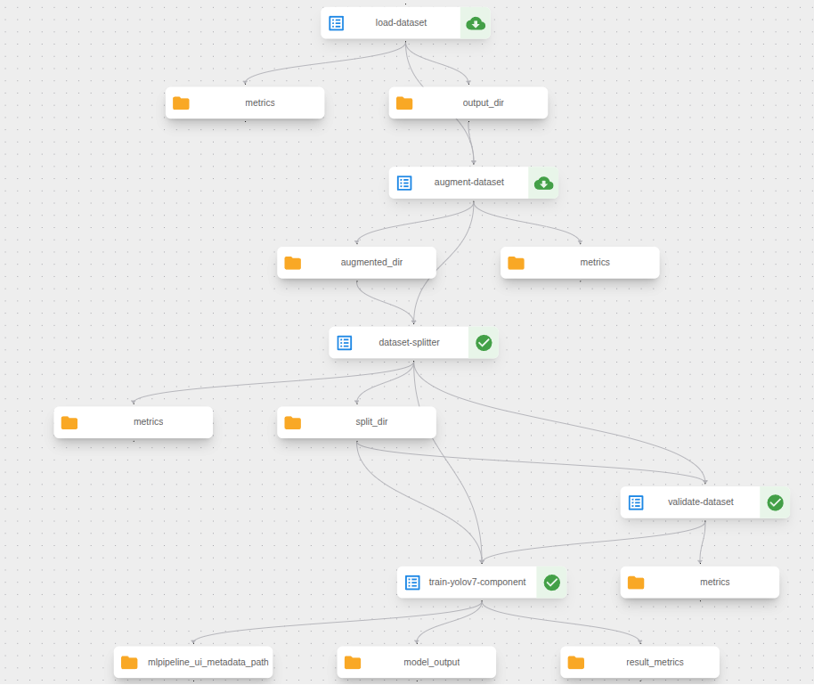

# End-to-End System Design, Optimization, and MLOps Strategy


## 1. System Design & Data Flow

### End-to-End Data Flow: From Camera to Cloud


#### 1. Camera Acquisition
- **Hardware:** Industrial **GigE cameras** capturing **12MP @ 20 FPS**.
- **Synchronization:** Achieved using **PTP** (Precision Time Protocol) or software alignment.
- **SDK Integration:** Manufacturer SDKs (C++/Python) handle:
  - Stream initiation  
  - Error recovery and reconnection  
  - Frame buffering and timestamps  
  - Camera parameter control (exposure, gain, etc.)
- **Multithreading:** Dedicated grabber threads isolate frame capture latency and push frames into FIFO buffers for downstream processing.

#### 2. GStreamer Preprocessing
- **Purpose:** Frame conversion, scaling, and delivery to virtual loopback devices for inference.
- **Pipeline Example:**
  ```bash
  gst-launch-1.0 aravissrc ! \
    video/x-bayer,format=rggb,width=1920,height=1080,framerate=20/1 ! \
    bayer2rgb ! \
    videoconvert ! \
    video/x-raw,format=RGB,width=1920,height=1080 ! \
    queue ! \
    v4l2sink device=/dev/videoX


* **Element Roles:**

  | Element        | Function                                  |
  | -------------- | ----------------------------------------- |
  | `aravissrc`    | Captures GigE frames                      |
  | `bayer2rgb`    | Converts raw Bayer to RGB                 |
  | `videoconvert` | Ensures compatibility with consumers      |
  | `queue`        | Buffers frames to prevent stalls          |
  | `v4l2sink`     | Streams processed frames to `/dev/videoX` |

#### 3. Inference Stage (YOLOv7)

* **Input:** Frames read from `/dev/videoX` using OpenCV.
* **Preprocessing:**

  ```python
  cap = cv2.VideoCapture('/dev/videoX')
  ret, frame = cap.read()
  input_img = preprocess_for_yolov7(frame)
  ```
* **Inference:**

  ```python
  with torch.no_grad():
      pred = model(input_img)
  ```
* **Output:** Bounding boxes, confidence scores, and class labels (e.g., person, seatbelt).

#### 4. Postprocessing & Results

* **Postprocessing:** Non-Max Suppression (NMS), confidence thresholding.
* **Metadata Enrichment:** Frame timestamp, camera ID, and inference latency.
* **Serialization:** JSON/PB2 format for logging or cloud upload.

#### 5. Cloud Integration

* **Cloud Uploads:** Send structured event data (not raw video) to GCS/BigQuery.
* **Cloud Analytics:** Aggregate long-term trends, drift analysis, and model performance reports.
* **Model Management:** Use **Kubeflow** + **Triton** for centralized inference and retraining orchestration.

---

### Ensuring Low Latency and High Throughput

| Strategy                | Description                                                                            |
| ----------------------- | -------------------------------------------------------------------------------------- |
| **Multithreading**      | Separate threads for capture, preprocessing, and inference to utilize multi-core CPUs. |
| **Async Batching**      | Combine multiple frames for inference using Triton’s dynamic batching.                 |
| **Zero-Copy Buffers**   | Avoid data serialization between processes (e.g., GStreamer to CUDA).                  |
| **Edge GPUs**           | Run inference locally to reduce network transfer time.                                 |
| **GigE Network Tuning** | Enable jumbo frames, QoS, and RDMA for lower packet latency.                           |
| **Parallel Pipelines**  | Each camera stream runs an independent pipeline instance to prevent blocking.          |

---

## 2. Real-World Constraints

### Handling Frame Drops and Delayed Frames

* **Timestamp Logging:** Record precise acquisition timestamps for every frame.
* **Buffered Processing:** Use **ring/FIFO buffers** to absorb temporary lags.
* **Frame Reordering:** Maintain temporal order via timestamp alignment.
* **Monitoring:** Track FPS, drop rate, and processing latency using Prometheus/Grafana.
* **Auto-Recovery:** SDK and GStreamer watchdogs restart broken pipelines automatically.

### Optimizing Edge vs Cloud Inference (Limited Bandwidth)

| Strategy                    | Description                                                                |
| --------------------------- | -------------------------------------------------------------------------- |
| **Edge-Centric Inference**  | Perform real-time YOLOv7 detection locally; send only detection metadata.  |
| **Selective Cloud Uploads** | Upload raw frames only for anomalies or low-confidence detections.         |
| **Model Compression**       | Use quantized or pruned models (TensorRT) for edge GPUs.                   |
| **Periodic Sync**           | Sync edge inference results to cloud storage asynchronously.               |
| **Dynamic Offload**         | Automatically shift to cloud inference when edge resources are overloaded. |

---

## 3. Model Deployment & MLOps

### Continuous Retraining and Zero-Downtime Deployment (Kubeflow + Triton)

#### Kubeflow Automation

* **Pipeline Design:** Automates data ingestion → training → evaluation → deployment.
* **Shadow/Canary Testing:**

  * *Shadow:* Run the new model on mirrored traffic for comparison.
  * *Canary:* Send a small percentage of live traffic to test new version.
* **Promotion Logic:** Automatically promote only if accuracy, latency, and regression checks pass.

#### Triton Model Deployment

* **Model Repository Structure:**

  ```
  model_repository/
    yolov7/
      1/
        model.onnx
      2/
        model.onnx
      config.pbtxt
  ```
* **Hot Reloading:** Triton dynamically loads new model versions without restarting the service.
* **Rolling Update (Kubernetes):**

  * Use `RollingUpdate` strategy in deployment YAMLs.
  * **Readiness probes** ensure new pods are ready before old ones terminate.

#### Example Kubeflow Deployment Pipeline

```python
import kfp
from kfp import dsl

@dsl.pipeline(name="YOLOv7 Continuous Deployment Pipeline")
def yolov7_pipeline():
    retrain = retrain_op(...)
    evaluate = evaluate_op(retrain.output)
    with dsl.Condition(evaluate.outputs['passed'] == 'true'):
        deploy = deploy_to_triton_op(evaluate.output)
        notify = notify_op(deploy.output)
```


---

### Safe Versioning and Rollback

* **Immutable Storage:** Store every model version with a unique tag (e.g., run ID or Git SHA).
* **Metadata Tracking:** Log training dataset, parameters, and performance metrics in Kubeflow Metadata.
* **Rollback:** Revert the Triton alias to a prior version by updating the model repository and reloading.
* **Automation:** Integrate rollback logic in CI/CD to handle failed canary deployments automatically.

---

## 4. Monitoring & Metrics

### Metrics for Real-Time Performance and Detection Accuracy

| Metric Category        | Key Metrics                                               | Purpose                          |
| ---------------------- | --------------------------------------------------------- | -------------------------------- |
| **System Performance** | FPS, latency per frame, GPU/CPU utilization, memory usage | Ensure real-time inference       |
| **Camera Health**      | Frame drop rate, timestamp jitter                         | Detect capture or network issues |
| **Inference Quality**  | Precision, recall, F1-score, mean confidence              | Track detection accuracy         |
| **Pipeline Stability** | Error counts, restart frequency, queue depth              | Detect stability regressions     |
| **Throughput**         | Frames processed per second per stream                    | Validate scaling efficiency      |

---

### Detecting Model Drift or Degraded Accuracy in Production

#### 1. Logging Drift Metrics

* Log drift scores and input/output distribution statistics to **Loki**.
* Example:

  ```json
  {
    "stream_id": "camera_07",
    "metric": "drift_score",
    "value": 0.42,
    "threshold": 0.3,
    "timestamp": "...",
    "model_version": "v1.13"
  }
  ```

#### 2. Grafana Visualization & Alerting

* **Dashboards:**

  * Frame rate, latency, inference heatmaps
  * Accuracy trends and drift over time
* **Example Loki Query:**

  ```bash
  {job="inference"} | json | stats avg(latency_ms) by(stream_id)
  ```
* **Alerts:**

  * Triggered when `drift_score > threshold`
  * Or when precision/recall drop below SLA
  * Integrated via Webhooks to Kubeflow for auto-retraining

#### 3. Automated Drift Response

* Grafana alert → webhook triggers **Kubeflow retraining pipeline**.
* Retraining incorporates recent drifted samples.
* Post-retrain validation and redeployment close the feedback loop.

---

## Summary Table: Key Technology Components

| Stage         | Key Functions               | Example Tech              | Metrics to Monitor             |
| ------------- | --------------------------- | ------------------------- | ------------------------------ |
| Camera/SDK    | Capture, buffer, timestamp  | Vendor SDK (C++/Python)   | FPS, drop rate, acquisition    |
| GStreamer     | Format, resize, stream      | Aravis, GStreamer         | Pipeline FPS, buffer health    |
| Inference     | Detection (YOLOv7/Triton)   | Triton, CUDA, TensorRT    | Inference time, accuracy       |
| Orchestration | CI/CD, retraining, metadata | Kubeflow Pipelines        | Workflow success, retrain logs |
| Monitoring    | Dashboards, drift, alerts   | Grafana, Prometheus, Loki | Drift, FP/FN stats             |
| Cloud Storage | Results, logs, analytics    | BigQuery, Firestore, GCS  | Query latency, data age        |

---

## Key Takeaways

* **Low Latency:** Achieved through multithreading, edge inference, and optimized GigE networking.
* **High Throughput:** Enabled via batching, parallel pipelines, and zero-copy memory.
* **Resilience:** Buffered frame handling and automated recovery prevent drops.
* **MLOps:** Kubeflow + Triton enable seamless retraining, versioning, and rollback.
* **Observability:** Loki and Grafana provide real-time monitoring, drift detection, and automated retraining triggers.

---
